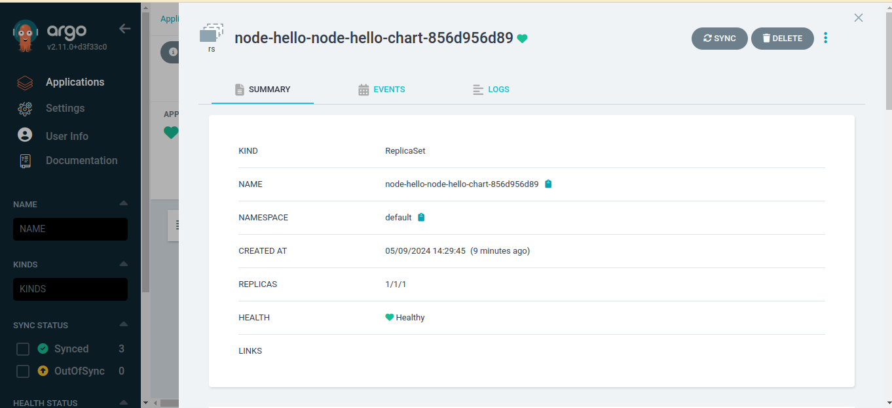

# node-deployment-kubernetes
Task: Dockerize and deploy a Node.js "Hello World" application on Kubernetes

Step1: Clone the repository
```
 	git clone https://github.com/TechArmor007/node-deployment-kubernetes.git
```

Step2: To Test Docker Image
```
        docker pull techarmor007/node-hello:latest
        docker run -it -d -p 3000:3000 techarmor007/node-hello:latest
	Run "http://locahost:3000" on browser
```
	
Step3: Install Docker (For Ubuntu):
```
 	sudo apt update
	sudo apt upgrade
	sudo apt install docker.io
	sudo systemctl start docker
	sudo systemctl enable docker	
	sudo chmod 777 /var/run/docker.sock
```	
Step4: Install Minikube (For Ubuntu) and wait for while after running minikube start:
```
 	curl -LO https://storage.googleapis.com/minikube/releases/latest/minikube-linux-amd64
	sudo install minikube-linux-amd64 /usr/local/bin/minikube
	minikube start	
```
	
Step5: Install Kubectl (For Ubuntu):
```
 	curl -LO "https://dl.k8s.io/release/$(curl -L -s https://dl.k8s.io/release/stable.txt)/bin/linux/amd64/kubectl"
	sudo install -o root -g root -m 0755 kubectl /usr/local/bin/kubectl
	kubectl config use-context minikube	
```
	
Step6: Install Helm
```
	curl https://raw.githubusercontent.com/helm/helm/main/scripts/get-helm-3 | bash
```

Step7: Deploy on ArgoCD
```
	kubectl create namespace argocd
	kubectl apply -n argocd -f https://raw.githubusercontent.com/argoproj/argo-cd/stable/manifests/install.yaml
```

Step8: Setting up the application on ArgoCD
```
	cd node-deployment-kubernetes/
	kubectl apply -f node-hello-argocd.yaml
```

Step9: ArgoCD Dashboard Password (Username - admin) for password run and copy the passowrd
```
	kubectl -n argocd get secret argocd-initial-admin-secret -o jsonpath="{.data.password}" | base64 --decode
```

Step10: Access Dashboard
for localhost Use "https://localhost:8080"
```
	kubectl port-forward svc/argocd-server -n argocd 8080:443
```

For EC2 Server Use "https://publicIP:8080"
```
	kubectl port-forward --address 0.0.0.0 svc/argocd-server -n argocd 8080:443
```

Because ArgoCD's server by default uses HTTPS, make sure to use https:// instead of http:// when accessing it through the browser. Remember to accept the security exception in your browser due to the use of a self-signed certificate by ArgoCD.

Snapshots of Deployment





